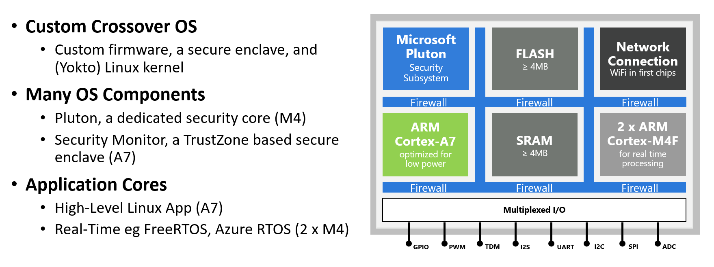
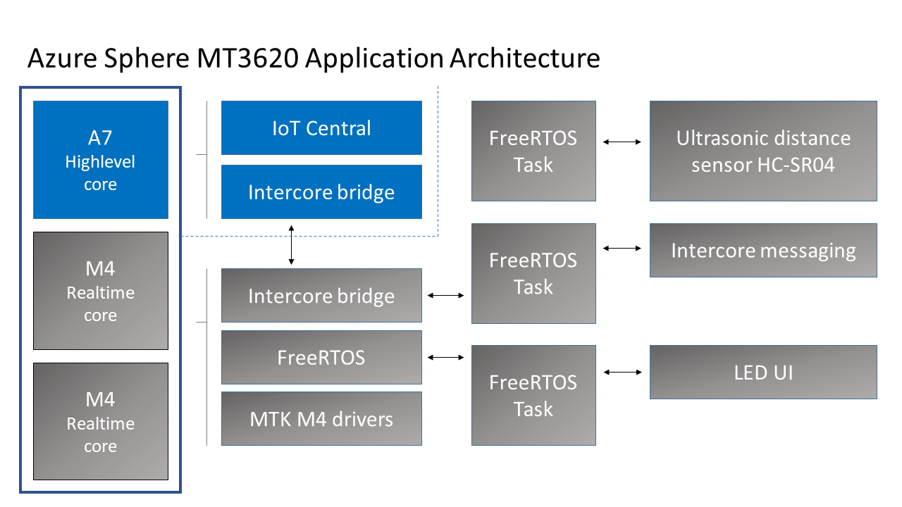
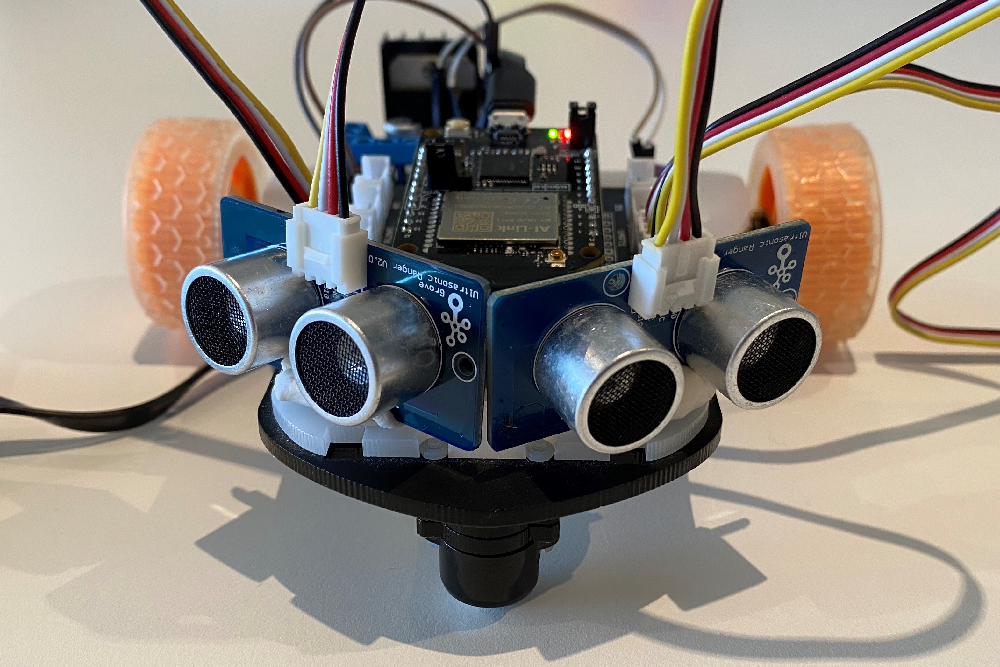
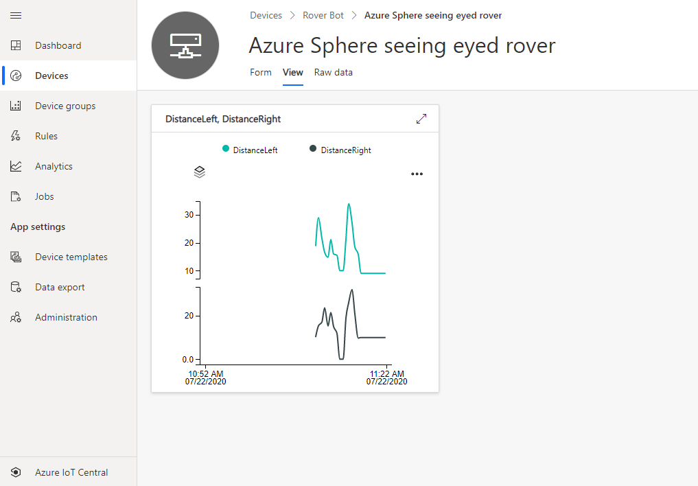

# Build a seeing eyed rover combining the best of Azure Sphere security and FreeRTOS

## What you will learn

You will learn how to integrate a Realtime FreeRTOS application responsible for running a timing sensitive ultrasonic distance sensor with the security and cloud connectivity of Azure Sphere.

---

## #JulyOT

This is part of the #JulyOT [IoT Tech Community](http://aka.ms/julyot) series, a collection of blog posts, hands-on-labs, and videos designed to demonstrate and teach developers how to build projects with Azure Internet of Things (IoT) services. Please also follow [#JulyOT](https://twitter.com/hashtag/JulyOT) on Twitter.

---

## Source code and learning resources

Source code: [Azure Sphere seeing eyed rover Realtime FreeRTOS sensors and Azure IoT](https://gloveboxes.github.io/Azure-Sphere-Rover-Bot-FreeRTOS-with-Azure-IoT/).

Learning resources: [Azure Sphere Developer Learning Path](https://github.com/gloveboxes/Azure-Sphere-Learning-Path).

---

## Learn more about Azure Sphere

[Azure Sphere](https://azure.microsoft.com/en-au/services/azure-sphere/?WT.mc_id=julyot-azd-dglover) is a comprehensive IoT security solution – including hardware, OS, and cloud components – to actively protect your devices, your business, and your customers.

Azure Sphere is made up of three interrelated components:

1. Azure Sphere-certified MCUs
2. Azure Sphere OS
3. Azure Sphere Security Service

---

## Azure Sphere Architecture

The Azure Sphere is built on the Mediatec MT3620. This crossover MCU consists of 5 cores. There is a dedicated communications core, a dedicated Security Subsystem core, and **three** user application cores.

The **three applications cores** are as follows:

* 1 x  ARM Cortex A7 core running Embedded Linux (built with Yokto), exposing a set of POSIX APIs. Developers can build and deploy a **High Level** application to this core. This core is also responsible for the TrustZone Security Monitor, threat detection reporting, and OS and Application life cycle management.
* 2 x ARM Cortex M4Fs. Developers can build and deploy **Real Time** applications to these cores. Real Time applications can be built against the bare metal or built using  real time frameworks such as FreeRTOS and Azure RTOS.

With Visual Studio and Visual Studio Code you can develop and debug applications running on all three cores. For example, you can simultaneously debug an app running on the A7 core and a M4 core FreeRTOS app.

---

## Application architecture

The application running on the Azure Sphere consists of two parts.

### Realtime FreeRTOS Application

* The Realtime FreeRTOS application running on one of the M4 cores that is responsible for running the timing sensitive HC-SR04 ultrasonic distance sensor.
* Distance is measured every 100 milliseconds so the rover can decide best route.
* The sensor requires precise microsecond timing to trigger the distance measurement process, so it is a perfect candidate for running on the Realtime core as a FreeRTOS Task.
* Every 5 seconds a FreeRTOS Task sends distance telemetry to the Azure Sphere A7 Highlevel application.

### Azure IoT Highlevel Application

The application running on the Azure Sphere A7 Highlevel application core is responsible for less timing sensitive tasks such as establishing WiFi/Network connectivity, negotiating security and connecting with Azure IoT Central, updating the device twin and send telemetry messages.

--

## Parts list

* 1 x [Seeed Studio Seeed Studio MT3620 Mini Dev Board](https://www.seeedstudio.com/mt3620-for-azure-sphere)
* 1 x [MT3620 Grove Breakout](https://www.seeedstudio.com/MT3620-Grove-Breakout-p-4043.html)
* 2 x [Grove - Ultrasonic Distance Sensor](https://www.seeedstudio.com/Grove-Ultrasonic-Distance-Sensor.html)
* 1 x H-Bridge driver. Seeed Studio have a [Grove - I2C Motor Driver](https://wiki.seeedstudio.com/Grove-I2C_Motor_Driver_V1.3/), or you can wire up your own H-Bridge connector to the Grove Breakout board.

## Azure IoT Central

[Azure IoT Central](https://azure.microsoft.com/en-in/services/iot-central/?WT.mc_id=julyot-co2-dglover) provides an easy way to connect, monitor, and manage your Internet of Things (IoT) assets at scale.

I created a free trial of [Azure IoT Central](https://azure.microsoft.com/en-gb/services/iot-central/?WT.mc_id=julyot-co2-dglover) and in no time I had the rover distance sensor charted and available for deeper analysis. By the way, you can continue to connect two devices for free to IoT Central after the trial period expires.

### Extend and integrate Azure IoT Central applications with other cloud services

Azure IoT Central is also extensible using rules and workflows. For more information, review [Use workflows to integrate your Azure IoT Central application with other cloud services](https://docs.microsoft.com/en-us/azure/iot-central/core/howto-configure-rules-advanced?WT.mc_id=julyot-co2-dglover)

## How to build the solution

1. Set up your [Azure Sphere development environment](https://github.com/gloveboxes/Azure-Sphere-Learning-Path/tree/master/zdocs_visual_studio_iot_central/Lab_0_Introduction_and_Lab_Set_Up).
2. Review [Integrate FreeRTOS Real-time room sensors with Azure IoT](https://github.com/gloveboxes/Azure-Sphere-Learning-Path/tree/master/zdocs_visual_studio_iot_central/Lab_5_FreeRTOS_and_Inter-Core_Messaging).
3. Learn how to connect and Azure Sphere to [Azure IoT Central](https://github.com/gloveboxes/Azure-Sphere-Learning-Path/tree/master/zdocs_visual_studio_iot_central/Lab_2_Send_Telemetry_to_Azure_IoT_Central) or [Azure IoT Hub](https://github.com/gloveboxes/Azure-Sphere-Learning-Path/tree/master/zdocs_vs_code_iot_hub/Lab_2_Send_Telemetry_to_Azure_IoT_Hub).
4. The IoT Central Device Template Capabilities Model JSON file for this solution is included in the **iot_central** directory of this repo.
